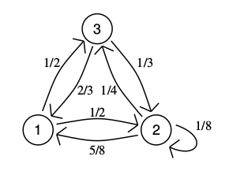

```{r setup, include=FALSE}
knitr::opts_chunk$set(echo = TRUE)
library("invgamma")
options(warn=-1)
library(igraph)
library(R2jags)
```

## 1 task

### 1a)  Illustrating the characteristics of the statistical model for dealing with the *Dugong*'s data. Data contains Lengths ($Y_i$)  and  ages ($x_i$) of  27 dugongs:

\begin{eqnarray*}
Y_i &\sim& N(\mu_i, \tau^2) \\
\mu_i=f(x_i)&=& \alpha - \beta \gamma^{x_i}\\
\end{eqnarray*}

Model parameters are
$\alpha \in (1, \infty)$,
$\beta \in (1, \infty)$,
$\gamma \in (0,1)$,
$\tau^2 \in (0,\infty)$. 

Prior distributions:
\begin{eqnarray*}
\alpha &\sim&  N(0,\sigma^2_{\alpha})\\
\beta  &\sim&  N(0,\sigma^2_{\beta}) \\
\gamma &\sim&  Unif(0,1)\\
\tau^2 &\sim&  IG(a,b)) (Inverse Gamma)
\end{eqnarray*}


Lets try to draw a DAG for the task we have:
```{r}
set.seed(12345)
ourvars<- list('Y',"alpha",'beta','gamma','X',"tau^2",'a','b','sigma_a','sigma_b')
firstgraph <- make_empty_graph() + vertices(ourvars)
colrs <- c("pink", "tomato", "yellow","yellow","purple","#46d689","#46d689","#46d689","tomato", "yellow")
V(firstgraph)$color <- colrs

# Add edges
firstgraph <- firstgraph + edges(V(firstgraph)[5],V(firstgraph)[1], color = "grey")+
  edges(V(firstgraph)[4],V(firstgraph)[1], color = "grey")+
  edges(V(firstgraph)[2],V(firstgraph)[1], color = "grey")+
  edges(V(firstgraph)[3],V(firstgraph)[1], color = "grey")+
  edges(V(firstgraph)[6],V(firstgraph)[1], color = "grey")+
  edges(V(firstgraph)[7],V(firstgraph)[6], color = "grey")+
  edges(V(firstgraph)[8],V(firstgraph)[6], color = "grey")+
  edges(V(firstgraph)[9],V(firstgraph)[2], color = "grey")+
  edges(V(firstgraph)[10],V(firstgraph)[3], color = "grey")
firstgraph$layout <- layout_as_star
plot(firstgraph)
```

We were provided with some 27 observations. Lets load them and try to plot:
We are interested in Y (Length) variable.

```{r}
dugong=read.table("dugong-data.txt", header = TRUE)
Y=dugong$Length
X=dugong$Age
par(mfrow=c(1,2))
hist(Y,freq=FALSE,breaks=7)
hist(X,freq=FALSE,breaks=7)

```

Our target value depends on several parameters. Each of them has its own distribution.
Lets look how distributions of parameters can be simulated:


```{r}
# initial values
set.seed(12345)
dugong=read.table("dugong-data.txt", header = TRUE)
Y=dugong$Length
X=dugong$Age
a=10
b=15
sigma_alpha=1
sigma_beta=1.5
alpha=mean(Y)+1
beta=1.2
gmma=0.8
tau=1
M=10000
NN=length(Y)
alpha_vec0=rep(NA,M)
beta_vec0=rep(NA,M)
gamma_vec0=rep(NA,M)
tau_vec0=rep(NA,M)
i=0
while (i<=M){
  idx<-sample(c(1:NN),1)
  x<- X[idx]
  y<- Y[idx]
  mu <- alpha - beta*(gmma^x)
  tau1 <- rinvgamma(1,shape=a,rate=b)
  alpha1 <- rnorm(1,mean=0,sd=(sigma_alpha))
  beta1 <- rnorm(1,mean=0,sd=(sigma_beta))
  gmma1 <- runif(1,0,1)
  if ( (alpha1>1) & (beta1>1)&(gmma1>0) & (gmma1<1) & (tau1>0) ){
    alpha_vec0[i]=alpha1
    beta_vec0[i]=beta1
    gamma_vec0[i]=gmma1
    tau_vec0[i]=tau1
    i=i+1
    
  }
  #i=i+1
}
```


lets plot them:


```{r}
par(mfrow=c(2,2))
hist(alpha_vec0, freq=FALSE)
hist(beta_vec0, freq=FALSE)
hist(gamma_vec0, freq=FALSE)
hist(tau_vec0,breaks=10000, freq=FALSE, xlim=c(0,10))
```


### 1b)  Derive the corresponding likelihood function

We can write likelihood function of target distribution as following:

<center>
\( L(y_i)=\prod_{i=1}^{n}{ \frac{1}{\sqrt{2\pi\tau^2}}}{e^{\frac{-(y_i-\alpha+\beta\gamma^{x_i})^2}{2\tau^2}}}\)
</center>

And then we can get:

<center>
\( L(y_i)={ (\frac{1}{\sqrt{2\pi\tau^2}}})^n{e^{\sum_{i=1}^{n}{\frac{-(y_i-\alpha+\beta\gamma^{x_i})^2}{2\tau^2}}}} \)
</center>


### 1c)  Write down the expression of the joint prior distribution of the parameters at stake and illustrate your suitable choice for the hyperparameters.

In this task we are assuming that all parameters of Y are independent. That is why we can write joint prior distribution as following:

<center>
\( \pi(\alpha,\beta,\gamma,\tau^2)={\pi_1(\alpha)\pi_2(\beta)\pi_3(\gamma)\pi_4(\tau^2)}\)
</center>

Lets put formulas in the equation above: 

<center>
\( \pi(\alpha,\beta,\gamma,\tau^2)={ \frac{1}{\sqrt{2\pi\sigma_\alpha^2}} e^{\frac{-\alpha^2}{2\sigma_\alpha^2}} \frac{1}{\sqrt{2\pi\sigma_\beta^2}} e^{\frac{-\beta^2}{2\sigma_\beta^2}} {\frac{b^a}{\Gamma(a)}\tau^{2(-a-1)}} e^{\frac{-b}{\tau^2}} I_\gamma(0,1)}\)
</center>

<center>
\( \pi(\alpha,\beta,\gamma,\tau^2)={ \frac{1}{{2\pi\sigma_\alpha\sigma_\beta}} e^{\frac{-\alpha^2}{2\sigma_\alpha^2}+\frac{-\beta^2}{2\sigma_\beta^2}+ \frac{-b}{\tau^2}} {\frac{b^a}{\Gamma(a)}\tau^{2(-a-1)}}I_\gamma(0,1)}\)
</center>

For inverse gamma we took :a=10 and b=15
For alpha value we took :sigma_alpha=1
For beta: sigma_beta=1.5
We gave following intial values: 
alpha=mean(Y)+1
beta=1.2
gamma=0.8
tau^2=1 (in the code it is tau)


### 1d)  Derive the functional form  (up to proportionality constants) of all *full-conditionals*

Using DAG we can write formulas for each parameter:

For tau^2 we can obtain: 

\( P(\tau^2|X,\alpha,\beta,\gamma,Y,a,b) = P((\tau^2|a,b)|X,\alpha,\beta,\gamma,Y) \propto P(X,\alpha,\beta,\gamma,Y|\tau^2,a,b) P(\tau^2|a,b) \propto P(Y|X,\alpha,\beta,\gamma,\tau^2)  P(\tau^2|a,b) \)

For alpha:

\( P(\alpha|X,\tau^2,\beta,\gamma,Y,\sigma_a) = P((\alpha|\sigma_a)|X,\tau^2,\beta,\gamma,Y) \propto P(X,\tau^2,\beta,\gamma,Y|\alpha,\sigma_a) P(\alpha|\sigma_a) \propto P(Y|X,\alpha,\beta,\gamma,\tau^2)  P(\alpha|\sigma_a)\)

For beta:

\( P(\beta|X,\tau^2,\alpha,\gamma,Y,\sigma_b) = P((\beta|\sigma_b)|X,\tau^2,\alpha,\gamma,Y) \propto P(X,\tau^2,\alpha,\gamma,Y|\beta,\sigma_b) P(\beta|\sigma_b) \propto P(Y|X,\alpha,\beta,\gamma,\tau^2)  P(\beta|\sigma_b)\)

For gamma:

\( P(\gamma|\tau^2,X,\alpha,\beta,Y) \propto  P(Y|X,\alpha,\beta,\gamma,\tau^2) I_{\gamma}(0,1) \)


### 1e)  Which distribution can you recognize within standard parametric   families so that direct simulation from full conditional can be easily implemented ?

Obtained formulas for full conditionals cannot be recognized as some distribution except gamma because gamma has distribution like target distribution just multipled to indicator function.


### 1f)  Using a suitable Metropolis-within-Gibbs algorithm simulate a Markov chain  ($T=10000$) to approximate the posterior distribution for the above model:

We can simulate from full conditionals that we wrote above:

```{r}
# initial values
set.seed(12345)
dugong=read.table("dugong-data.txt", header = TRUE)
Y=dugong$Length
X=dugong$Age
a=10
b=15
sigma_alpha=1
sigma_beta=1.5
alpha=mean(Y)+1
beta=1.2
gmma=0.8
tau=1 # tau square
M=10000

# Full conditionals
NN=length(Y)
alpha_vec=rep(NA,M)
beta_vec=rep(NA,M)
gamma_vec=rep(NA,M)
tau_vec=rep(NA,M)
i=0
#x<-mean(X)
while (i<=M){
  idx<-sample(c(1:NN),1)
  x<- X[idx]
  y<- Y[idx]
  mu <- alpha - beta*(gmma^x)
  tau1 <- rnorm(1,mean=mu,sd=sqrt(tau))*rinvgamma(1,shape=a,rate=b)
  alpha1 <- rnorm(1,mean=mu,sd=sqrt(tau))*rnorm(1,mean=0,sd=(sigma_alpha))
  beta1 <- rnorm(1,mean=mu,sd=sqrt(tau))*rnorm(1,mean=0,sd=(sigma_beta))
  gmma1 <- rnorm(1,mean=mu,sd=sqrt(tau))
  if ( (alpha1>1) & (beta1>1)&(gmma1>0) & (gmma1<1) & (tau1>0) ){
    alpha_vec[i]=alpha1
    beta_vec[i]=beta1
    gamma_vec[i]=gmma1
    tau_vec[i]=tau1
    i=i+1
    
  }
  
  
}
all_vecs=cbind(alpha_vec,beta_vec,gamma_vec,tau_vec)
```


After running a code for obtaining different parameters, lets plot them:


```{r}
par(mfrow=c(2,2))
hist(alpha_vec, freq=FALSE, xlim=c(0,20),breaks=100)
hist(beta_vec, freq=FALSE, xlim=c(0,20),breaks=100)
hist(gamma_vec,freq=FALSE)
hist(tau_vec, breaks = 10000, freq=FALSE,xlim=c(0,20))
```


### 1g) Show the 4 univariate trace-plots of the simulations of each parameter

We can draw trace-plots with type l plots.

```{r}
par(mfrow=c(2,2))
plot(alpha_vec,type="l")
plot(beta_vec,type="l")
plot(tau_vec,type="l")
plot(gamma_vec,type="l")
```


### 1h)  Evaluate graphically the behaviour of the empirical averages $\hat{I}_t$  with growing $t=1,...,T$


```{r}
M=length(alpha_vec)
cum_s_A=rep(NA,M)
cum_s_B=rep(NA,M)
cum_s_T=rep(NA,M)
cum_s_G=rep(NA,M)
s_A=0
s_B=0
s_G=0
s_T=0
for ( i in 1:M){
  s_A<-s_A+alpha_vec[i]
  cum_s_A[i]<- s_A/i
  s_B<-s_B+beta_vec[i]
  cum_s_B[i]<- s_B/i
  s_T<-s_T+tau_vec[i]
  cum_s_T[i]<- s_T/i
  s_G<-s_G+gamma_vec[i]
  cum_s_G[i]<- s_G/i
}
par(mfrow=c(2,2))
plot(cum_s_A, col="orchid", xlim=c(0,700))
plot(cum_s_B, col="blue", xlim=c(0,700))
plot(cum_s_T, col="red", xlim=c(0,700))
plot(cum_s_G, col="pink", xlim=c(0,700))
```

For all the parameters empirical average converges to some value after 200 iterations.

### 1i)  Provide estimates for each parameter together with the approximation error and explain how you have evaluated such error

As in many cases, for this task we can use mean of our obtained values of parameters from simulation.

```{r}
est_alpha<-mean(alpha_vec)
est_beta<- mean(beta_vec)
est_tau<- mean(tau_vec)
est_gamma<- mean(gamma_vec)
cat(" Estimate for alpha: ", est_alpha,"\n", "Estimate for beta: ", est_beta,"\n","Estimate for gamma: ", est_gamma,"\n", "Estimate for tau square: ", est_tau)
```

approximation error

```{r}
est_alpha_err<- mean(abs(alpha_vec0-est_alpha)/alpha_vec0)
est_beta_err<- mean(abs(beta_vec0-est_beta)/beta_vec0)
est_tau_err<-   mean(abs(tau_vec0-est_tau)/tau_vec0)
est_gamma_err<-  mean(abs(gamma_vec0-est_gamma)/gamma_vec0)
cat(" err alpha: ", est_alpha_err,"\n", "err beta: ", est_beta_err,"\n","Err gamma: ", est_gamma_err,"\n", "Err tau square: ", est_tau_err)
```

### 1l)  Which parameter has the largest posterior uncertainty? How did   you measure it? 

We can find the largest posterior uncertainty by dividing the standard deviation over the absolute value of the mean.
In the results below we can see that beta has the largest posterior uncertainity.

```{r}
unc_alpha<- sd(alpha_vec)/est_alpha
unc_beta <- sd(beta_vec)/est_beta
unc_tau<- sd(tau_vec)/est_tau
unc_gamma <- sd(gamma_vec)/est_gamma

cat(" Posterior uncertainty for alpha: ", unc_alpha,"\n","Posterior uncertainty for beta: ", unc_beta,"\n","Posterior uncertainty for gamma: ", unc_gamma,"\n","Posterior uncertainty for tau square: ", unc_tau)
```


### 1m)  Which couple of parameters has the largest correlation (in absolute value)?

```{r}
correlations=cor(all_vecs)
correlations
```

According to the result of cor function above tau and alpha values are the highest correlated.


### 1n)  Use the Markov chain to approximate the posterior predictive distribution of the length   of a dugong with age of 20 years.


```{r}
pred_twenty=rep(NA,M)
x_age=20
for (i in 1:M){
  pred_twenty[i]<- rnorm(1, mean= alpha_vec[i]-beta_vec[i]*(gamma_vec[i]^x_age), sd=sqrt(tau_vec[i]))
}
mean(pred_twenty)
```


### 1o)  Provide the prediction of a different dugong with age 30 

```{r}
pred_thirty=rep(NA,M)
x_age=30
for (i in 1:M){
  pred_thirty[i]<- rnorm(1, mean= alpha_vec[i]-beta_vec[i]*(gamma_vec[i]^x_age), sd=sqrt(tau_vec[i]))
}
mean(pred_thirty)
```


1p)  Which prediction is less precise?

Prediction for age 30 is less precise, because if we look at data it decrease with age 31, the only observation that we have after 29. So it seems that it is more logical if at 30 it will aslo decrease.


## 2)  Let us consider a Markov chain  $(X_t)_{t \geq 0}$ defined on the state space ${\cal S}=\{1,2,3\}$ with the following transition 


<center>

</center>


### 2a)  Starting at time $t=0$ in the state  $X_0=1$ simulate the Markov chain with distribution assigned as above for $t=1000$ consecutive times

Here we will right the trasition prob.matrix of the graph that we have and evaluate simulations on moving from one state to another.

```{r}
set.seed(12345)
S=c(1,2,3)
n_samples=1000
s_p_1<-c(0,0.5,0.5)
s_p_2<-c(5/8,1/8,1/4)
s_p_3<-c(2/3,1/3,0)
x0<-1
tpm<- matrix(c(s_p_1,s_p_2,s_p_3),nrow=3,byrow=T)
chain<-rep(NA,n_samples+1) # vector that will hold
                         # all the simulated values
chain[1]<-x0             # starting value x0 assigned to chain[1]
for(t in 1:n_samples){
  chain[t+1]<-sample(S,size=1,prob=tpm[chain[t],])
}
```

### 2b)  compute the empirical relative frequency of the two states in your simulation

So lets show frequencies of states 2 and 3

```{r}
#sum(chain==1)/n_samples
sum(chain==2)/n_samples
sum(chain==3)/n_samples
```


### 2c)  repeat the simulation for 500 times and record only the final state at time $t=1000$ for each of the 500 simulated chains. Compute the relative   frequency of the 500 final states. What distribution are you approximating in this way?   Try to formalize the difference between this point and the previous point. 


```{r}
set.seed(12345)
nsim<- 500
TT<-1000
x0<-1
targets<- rep(NA,nsim)
for (i in 1:nsim){
  chain[1]<-x0
  for (t in 1:TT){
    chain[t+1]<-sample(S,size=1,prob=tpm[chain[t],])
  }
  targets[i]<-chain[TT+1]
}
prop.table(table(targets))

```

Results that we obtain in this part is close to the results from previous part. So we can say that we will anyway end up with the same state. In this case we are trying to implement Monte Carlo simulation of Markov chains. The difference is that here we are taking into consideration the final state in each iteration of simulation and computed frequencies while in the previous task we were looking at 1000 chains and we computed from them frequencies.


### 2d)  compute the theoretical stationary distribution $\pi$ and explain how   you have obtained it

Here we are using eigenvalues and eigenvectors. At the begining we transposed TPM and we got eigenvalues.
Then we are using the first eigenvector. We normalized it. And we got pretty close results as in previous task.

```{r}
P<-tpm
t(P) #"trasposed TPM"
eigen(t(P))#"eigenvalues and eigenvectors"
eigen(t(P))$vectors[,1] #"fisrt eigen"
pi <-eigen(t(P))$vector[,1]/sum(eigen(t(P))$vector[,1])
pi #("our pi")
t(P)%*%pi #("pi multipled with trasposed TPM")
```


### 2e)  is it well approximated by the simulated empirical relative frequencies computed in (b) and (c)?
yes

### 2f)  what happens if we start at $t=0$ from state  $X_0=2$ instead of  $X_0=1$?

It does not matter where to start, anyway we will obtain close result as in previous tasks:

```{r}
set.seed(12345)
S=c(1,2,3)
n_samples=1000
s_p_1<-c(0,0.5,0.5)
s_p_2<-c(5/8,1/8,1/4)
s_p_3<-c(2/3,1/3,0)
x0<-2
tpm<- matrix(c(s_p_1,s_p_2,s_p_3),nrow=3,byrow=T)
chain<-rep(NA,n_samples+1) # vector that will hold
                         # all the simulated values
chain[1]<-x0             # starting value x0 assigned to chain[1]
for(t in 1:n_samples){
  chain[t+1]<-sample(S,size=1,prob=tpm[chain[t],])
}
sum(chain==1)/n_samples
sum(chain==2)/n_samples
sum(chain==3)/n_samples
```
 


```{r}
set.seed(12345)
nsim<- 500
TT<-1000
x0<-2
targets<- rep(NA,nsim)
for (i in 1:nsim){
  chain[1]<-x0
  for (t in 1:TT){
    chain[t+1]<-sample(S,size=1,prob=tpm[chain[t],])
  }
  targets[i]<-chain[TT+1]
}
prop.table(table(targets))
```

By using eigenvalues and eigenvectors:


```{r}
P<-tpm
t(P)
eigen(t(P))
eigen(t(P))$vectors[,1]
pi <-eigen(t(P))$vector[,1]/sum(eigen(t(P))$vector[,1])
pi
t(P)%*%pi
```

